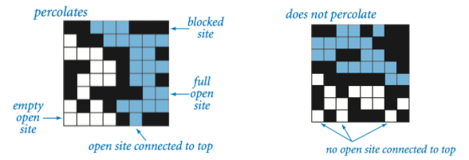
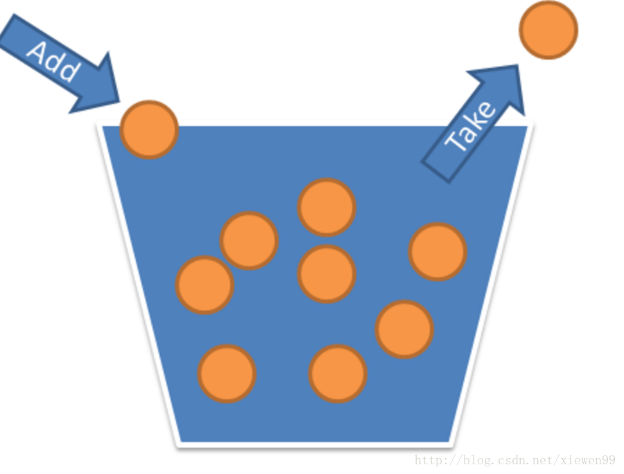
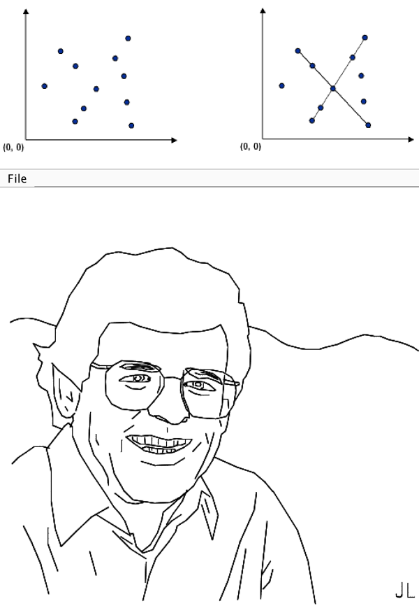
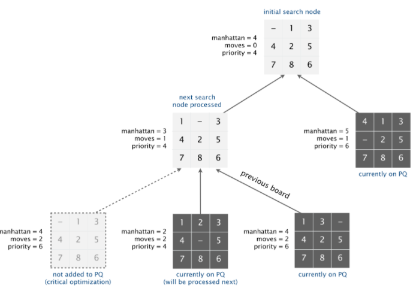
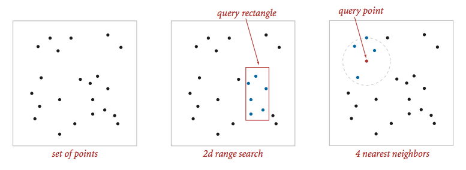

# AlgoRithm SolUTION & NOTE
Notes and solution of Princeton Algorithms

| Assignment                 | Description                              |
| -------------------------- | ---------------------------------------- |
| 1. Pecolation              | A program to estimate the value of the percolation threshold via Monte Carlo simulation. |
| 2. Deque & Randomize Queue | A generic data type for a deque and a randomized queue. |
| 3. Collinear Points        | A program to recognize line patterns in a given set of points and investigate a particularly clean pattern recognition problem involving points and line segments. |
| 4. 8-puzzle                | solve the 8-puzzle problem using the A* search algorithm |
| 5. KdTree                  | implemented a 2d-tree to support efficient range search and nearest neighbor search |
|                            |                                          |

| Assignment                  |                                          |
| --------------------------- | ---------------------------------------- |
| 1. Percolation              |  |
| 2. Deque & Randomized Queue |  |
| 3. Collinear Points         |  |
| 4. 8-puzzle                 |  |
| 5. kdTree                   |  |
|                             |                                          |

